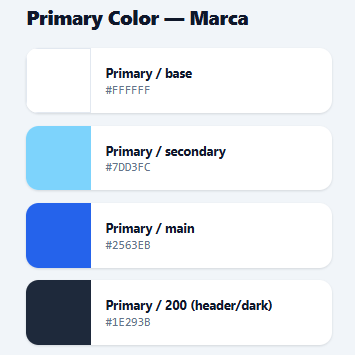
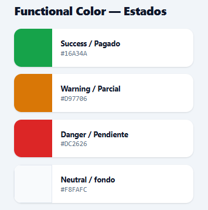
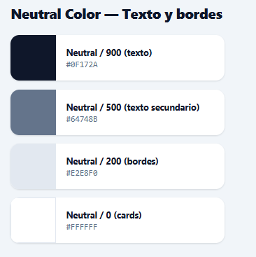
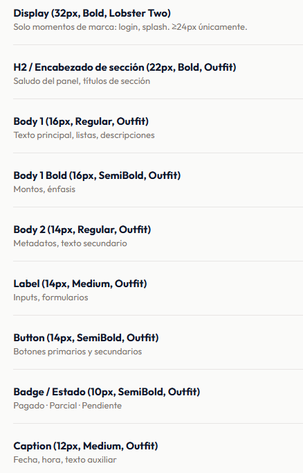
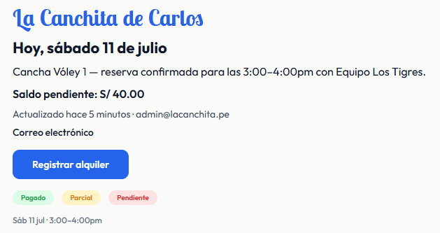
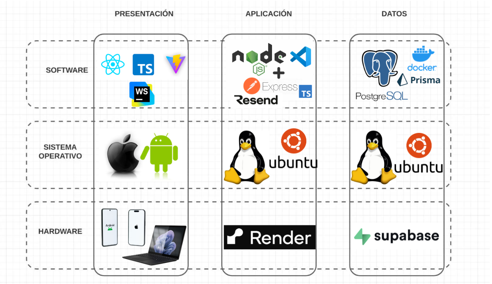

 

## Sistema de Gestión de Alquiler de Canchas 

 

# La Canchita de Carlos

 
 
 

### Documento de Producto — Propuesta 1 (Uso Interno)

 

**Cliente: Carlos Maldonado**

**Desarrolladora: Brianna Salinas**

 

*Plazo: 2 semanas (documentación, diseño, prototipo, desarrollo, pruebas y despliegue)*

 

**Fecha**

### **Julio 2026**

 

---

# Tabla de Contenidos
 
[Capítulo I: Introducción](#capítulo-i-introducción)
* [1.1. Perfil del negocio](#11-perfil-del-negocio)
* [1.2. Alcance del producto](#12-alcance-del-producto)
* [1.3. Objetivos del proyecto](#13-objetivos-del-proyecto)
* [1.4. Usuarios del sistema](#14-usuarios-del-sistema)
  
[Capítulo II: Especificación de Requisitos](#capítulo-ii-especificación-de-requisitos)
* [2.1. Requisitos Funcionales (RF)](#21-requisitos-funcionales-rf)
* [2.2. Requisitos No Funcionales (RNF)](#22-requisitos-no-funcionales-rnf)
* [2.3. Lenguaje Ubicuo (Glosario del Dominio)](#23-lenguaje-ubicuo-glosario-del-dominio)
* [2.4. User Stories](#24-user-stories)
* [2.5. Product Backlog](#25-product-backlog)
  
[Capítulo III: Diseño de Producto (UX/UI)](#capítulo-iii-diseño-de-producto-uxui)
* [3.1. Arquitectura de Información](#31-arquitectura-de-información)
* [3.2. Wireframes](#32-wireframes)
* [3.3. Prototipo en Figma](#33-prototipo-en-figma)
* [3.4. Guía de Estilos](#34-guía-de-estilos)
  
[Capítulo IV: Arquitectura de Software (Domain-Driven Design)](#capítulo-iv-arquitectura-de-software-domain-driven-design)
* [4.1. Event Storming (Diseño)](#41-event-storming-diseño)
* [4.2. Bounded Contexts y Context Map](#42-bounded-contexts-y-context-map)
* [4.3. Diagrama de Contexto (C4 - Nivel 1)](#43-diagrama-de-contexto-c4---nivel-1)
* [4.4. Diagrama de Contenedores (C4 - Nivel 2)](#44-diagrama-de-contenedores-c4---nivel-2)
* [4.5. Diagrama de Componentes (C4 - Nivel 3)](#45-diagrama-de-componentes-c4---nivel-3)
* [4.6. Arquitectura en la Nube (PWA)](#46-arquitectura-en-la-nube-pwa)
* [4.7. Análisis Técnico-Económico de la Infraestructura](#47-análisis-técnico-económico-de-la-infraestructura)
  
[Capítulo V: Diseño Orientado a Objetos](#capítulo-v-diseño-orientado-a-objetos)
* [5.1. Diagrama de Clases — Backend](#51-diagrama-de-clases--backend)
* [5.2. Diagrama de Clases — Frontend](#52-diagrama-de-clases--frontend)
  
[Capítulo VI: Diseño de Base de Datos](#capítulo-vi-diseño-de-base-de-datos)
* [6.1. Modelo Entidad-Relación](#61-modelo-entidad-relación)
* [6.2. Diagrama de Base de Datos](#62-diagrama-de-base-de-datos)
* [6.3. Diccionario de Datos](#63-diccionario-de-datos)
  
[Capítulo VII: Gestión del Proyecto (Scrum, 2 semanas)](#capítulo-vii-gestión-del-proyecto-scrum-2-semanas)
* [7.1. Plan de Sprints](#71-plan-de-sprints)
* [7.2. Sprint 1 — Documentación, Diseño y Base del Sistema](#72-sprint-1--documentación-diseño-y-base-del-sistema)
* [7.3. Sprint 2 — Desarrollo, Integración, Pruebas y Despliegue](#73-sprint-2--desarrollo-integración-pruebas-y-despliegue)
* [7.4. Definition of Done](#74-definition-of-done)
  
[Capítulo VIII: Implementación](#capítulo-viii-implementación)
* [8.1. Configuración del Entorno de Desarrollo](#81-configuración-del-entorno-de-desarrollo)
* [8.2. Gestión de Código Fuente](#82-gestión-de-código-fuente)
* [8.3. Convenciones de Código](#83-convenciones-de-código)
* [8.4. Configuración de Despliegue](#84-configuración-de-despliegue)
* [8.5. Avance por Sprint](#85-avance-por-sprint)
  
[Capítulo IX: Pruebas y Validación](#capítulo-ix-pruebas-y-validación)
* [9.1. Estrategia de Pruebas](#91-estrategia-de-pruebas)
* [9.2. Casos de Prueba Clave](#92-casos-de-prueba-clave)
* [9.3. Validación con el Cliente](#93-validación-con-el-cliente)
  
[Capítulo X: Despliegue](#capítulo-x-despliegue)
* [10.1. Ambiente de Producción](#101-ambiente-de-producción)
* [10.2. Checklist de Despliegue](#102-checklist-de-despliegue)
* [10.3. Plan de Rollback](#103-plan-de-rollback)
  
[Anexos](#anexos)

 

---
 
# Capítulo I: Introducción
 
## 1.1. Perfil del negocio

"La Canchita de Carlos" opera dentro de la Institución Educativa N.° 1278 Mixto La Molina (Jr. Cusco 416, La Molina, Lima), donde Carlos Maldonado administra el alquiler de las canchas deportivas del plantel — vóley, fútbol y básquet, cinco espacios en total — fuera del horario escolar. Este modelo permite aprovechar la infraestructura deportiva del colegio como fuente de ingreso adicional, alquilando las canchas a equipos, grupos e instituciones externas en las tardes, noches y fines de semana.
 
Actualmente, la gestión de las reservas se realiza de forma manual: los horarios se coordinan por llamadas o mensajes, los pagos se registran en cuadernos o notas sueltas (efectivo, Yape), y no existe un sistema centralizado que Carlos y su trabajador puedan consultar en tiempo real. Esto genera dos problemas recurrentes: dobles reservas de una misma cancha en el mismo horario (con el consecuente conflicto frente a los clientes) y falta de visibilidad clara sobre cuánto se ha alquilado, cuánto se ha cobrado y qué pagos quedan pendientes en un día determinado.
 
El sistema busca resolver esto centralizando la gestión de las cinco canchas en una sola herramienta accesible desde el celular o la computadora, exclusiva para Carlos y su trabajador, sin exponer el sistema a los clientes finales (alcance definido en la Propuesta 1).

 

## 1.2. Alcance del producto

El presente documento desarrolla la **Propuesta 1 — Uso interno**, aceptada por el cliente sobre la Propuesta 2, en función del plazo real disponible (2 semanas) y el presupuesto acordado. El sistema es de uso exclusivo de Carlos y su trabajador; los clientes finales no acceden a la aplicación ni realizan reservas ni pagos por este medio.

 

**Incluido en el alcance:**

- Gestión de usuarios administradores (inicio de sesión seguro, múltiples administradores, control de acceso).

- Gestión de alquileres: calendario de disponibilidad (diario/semanal/mensual), registro/edición/cancelación, bloqueo automático de horarios ocupados, bloqueo manual por mantenimiento, historial con búsqueda y filtros.

- Gestión de clientes: registro, edición, eliminación e historial básico.

- Gestión de las cinco canchas: alta y edición, configuración de precios, vista general de disponibilidad.

- Gestión de pagos: estado (pagado/pendiente), pagos parciales, método de pago — registrados manualmente por el administrador (efectivo, Yape, etc.), sin pasarela de pago integrada.

- Panel principal con alquileres, ingresos y pagos pendientes del día.

- Aplicación PWA instalable, con diseño responsive optimizado para uso desde celular.

 

**Explícitamente fuera de alcance en esta fase:**
- Acceso o reservas por parte de clientes finales (celular/tablet/PC de los clientes).

- Pago online con tarjeta o pasarela de pagos.

- Notificaciones automáticas (correo, WhatsApp, recordatorios).

- Reportes exportables en PDF/Excel más allá del panel del día.

Estos puntos corresponden íntegramente a la **Propuesta 2 — Plataforma con clientes** (S/ 2,800 – 3,000, 2 a 3.5 meses), la cual queda documentada como fase de evolución futura del sistema y no forma parte del desarrollo actual. La arquitectura definida en el Capítulo IV se diseña de modo que esta segunda fase sea una extensión y no un rediseño del sistema.

 

## 1.3. Objetivos del proyecto

**Objetivo general**

Diseñar e implementar un sistema PWA de gestión de alquiler de canchas para "La Canchita de Carlos", que centralice la administración de alquileres, clientes, canchas y pagos en una sola herramienta de uso interno, eliminando la doble reserva de horarios y dando visibilidad diaria de la operación del negocio.

## 1.4. Usuarios del sistema
 
El sistema tiene un único rol funcional — **Administrador** — asignado a dos personas con el mismo nivel de acceso, sin jerarquía entre ellas dentro de la aplicación:

 

| Usuario | Rol | Responsabilidades principales |
|---|---|---|
| Carlos Maldonado | Administrador / dueño | Gestión general del negocio: precios de canchas, revisión de ingresos y pendientes, alta de nuevos administradores si fuera necesario. |
| Trabajador autorizado | Administrador secundario | Operación del día a día: registrar y confirmar alquileres, atender llamadas/mensajes de clientes y reflejarlos en el sistema, registrar pagos. |

 

No existe un rol de "cliente" dentro del sistema en esta fase los clientes de Carlos no inician sesión ni interactúan directamente con la aplicación, solo son gestionados como registros dentro del módulo de clientes. Este punto es clave para el diseño de la autenticación (RF01–RF03): basta con un control de acceso simple de 2 usuarios, sin necesidad de un sistema de roles complejo en esta etapa.

 

---
 
# Capítulo II: Especificación de Requisitos
 
## 2.1. Requisitos Funcionales (RF)

Requisitos derivados del alcance definido en 1.2, agrupados por módulo (bounded context), con prioridad asignada según su criticidad para resolver el problema central del negocio: la doble reserva y la falta de visibilidad de ingresos.

 

**Módulo: Gestión de usuarios**
 
| ID | Descripción | Prioridad |
|---|---|---|
| RF01 | El sistema debe permitir el inicio de sesión de un administrador mediante correo/usuario y contraseña, validando credenciales antes de dar acceso. | Alta |
| RF02 | El sistema debe soportar al menos 2 cuentas de administrador (Carlos y su trabajador) operando de forma independiente y simultánea. | Alta |
| RF03 | El sistema debe restringir el acceso a la información únicamente a usuarios autenticados; ninguna ruta de datos debe ser accesible sin sesión válida. | Alta |

 

**Módulo: Gestión de alquileres**
 
| ID | Descripción | Prioridad |
|---|---|---|
| RF04 | El sistema debe mostrar un calendario de disponibilidad de las 5 canchas en vista diaria, semanal y mensual. | Alta |
| RF05 | El sistema debe permitir registrar, editar y cancelar un alquiler, asociándolo a una cancha, un cliente, una fecha y un horario. | Alta |
| RF06 | El sistema debe impedir el registro de un nuevo alquiler si la cancha ya tiene un alquiler activo en el mismo horario (regla central del negocio). | Alta — crítica |
| RF07 | El sistema debe permitir bloquear manualmente un horario de una cancha por motivo de mantenimiento, excluyéndolo de la disponibilidad. | Media |
| RF08 | El sistema debe mantener un historial de alquileres, con filtros por fecha, cancha, cliente y estado. | Media |

 

**Módulo: Gestión de clientes**
 
| ID | Descripción | Prioridad |
|---|---|---|
| RF09 | El sistema debe permitir registrar, editar y eliminar clientes (nombre, contacto). | Media |
| RF10 | El sistema debe mostrar el historial básico de alquileres asociado a cada cliente. | Baja |

 

**Módulo: Gestión de canchas**
 
| ID | Descripción | Prioridad |
|---|---|---|
| RF11 | El sistema debe permitir dar de alta y editar las 5 canchas (nombre, disciplina: vóley/fútbol/básquet). | Alta |
| RF12 | El sistema debe permitir configurar el precio por cancha, y opcionalmente por franja horaria. | Media |
| RF13 | El sistema debe mostrar una vista general de disponibilidad consolidada de todas las canchas. | Alta |

 

**Módulo: Gestión de pagos**
 
| ID | Descripción | Prioridad |
|---|---|---|
| RF14 | El sistema debe permitir registrar el estado de pago de un alquiler (pagado / pendiente). | Alta |
| RF15 | El sistema debe permitir registrar pagos parciales, indicando el monto abonado y el saldo restante. | Media |
| RF16 | El sistema debe permitir registrar el método de pago utilizado (efectivo, Yape, u otro). | Baja |

 

**Módulo: Panel principal**
 
| ID | Descripción | Prioridad |
|---|---|---|
| RF17 | El sistema debe mostrar en el panel principal los alquileres registrados para el día actual. | Alta |
| RF18 | El sistema debe calcular y mostrar el ingreso total del día en base a los pagos registrados. | Alta |
| RF19 | El sistema debe mostrar el listado de pagos pendientes del día. | Alta |

 

## 2.2. Requisitos No Funcionales (RNF)

Requisitos de calidad del sistema, con criterio medible cuando aplica, alineados a la infraestructura definida en 4.6/4.7 (Vercel, Render, Neon).

 

| ID | Categoría | Descripción | Criterio de aceptación |
|---|---|---|---|
| RNF01 | Seguridad | Autenticación de administradores y protección de rutas de datos. | Contraseñas hasheadas con bcrypt; sesión mediante JWT con expiración; todo el tráfico servido por HTTPS. |
| RNF02 | Disponibilidad | El sistema debe estar operativo durante el horario de alquiler del negocio (tardes, noches y fines de semana). | Se acepta latencia de "arranque en frío" del backend (Render free tier) tras inactividad prolongada; no se exige SLA formal en esta fase. |
| RNF03 | Usabilidad | Interfaz optimizada para uso desde celular, principal dispositivo del administrador en campo. | Diseño responsive validado en al menos una resolución móvil real antes del despliegue (ver 9.2). |
| RNF04 | Instalabilidad | La app debe poder instalarse como PWA sin pasar por tienda de aplicaciones. | Manifest + service worker configurados; prompt de instalación funcional en Chrome/Android como mínimo. |
| RNF05 | Rendimiento | Tiempos de respuesta aceptables para el volumen de uso real (2 administradores, decenas de alquileres/día). | Registro de un alquiler y carga del panel del día responden en menos de 3 segundos con backend "caliente". |
| RNF06 | Escalabilidad | La arquitectura no debe requerir rediseño al evolucionar hacia la Propuesta 2. | Los subdominios definidos en 4.2 (Pagos, Notificaciones) deben poder extenderse o activarse sin modificar el subdominio núcleo de Reservas. |
| RNF07 | Mantenibilidad | El código debe organizarse por dominio, no por tipo técnico de archivo. | Estructura de carpetas del backend refleja los bounded contexts (4.2) y la separación hexagonal (4.0). |
| RNF08 | Respaldo de datos | La información no debe depender de un único punto de falla. | Backups automáticos habilitados en el proveedor de base de datos (Neon/Supabase) desde el primer despliegue en producción. |
| RNF09 | Compatibilidad | La PWA debe funcionar en los navegadores/dispositivos reales que usan Carlos y su trabajador. | Verificada en Chrome (Android) y un navegador de escritorio como mínimo. |
 
 

## 2.3. Lenguaje Ubicuo (Glosario del Dominio)

Términos consensuados organizados por bounded context, para que el vocabulario del negocio y el vocabulario del código sean el mismo.

 

**Subdominio Reservas**
 
| Término | Significado |
|---|---|
| Cancha | Espacio deportivo alquilable del colegio (vóley, fútbol o básquet). Actualmente son 5, pero el catálogo es administrable por Carlos (RF11), no un número fijo en el sistema. |
| Franja horaria | Bloque de tiempo en el que una cancha puede alquilarse (ej. 6:00 pm – 7:00 pm). |
| Alquiler | Reserva confirmada de una cancha, para un cliente, en una fecha y franja horaria específica. |
| Doble reserva | Situación inválida en la que dos alquileres ocupan la misma cancha en la misma franja horaria. El sistema debe impedirla siempre (RF06). |
| Bloqueo por mantenimiento | Franja horaria marcada como no disponible por el administrador, sin estar asociada a un alquiler. |
| Disponibilidad | Estado de una cancha en una franja horaria: libre, alquilada o bloqueada. |

 

**Subdominio Pagos**
 
| Término | Significado |
|---|---|
| Pago | Registro de dinero recibido por un alquiler. Puede ser total o parcial. |
| Pago parcial | Pago que cubre solo una parte del monto total del alquiler; el alquiler queda con saldo pendiente. |
| Pendiente | Estado de un alquiler cuyo monto (total o restante) aún no ha sido cobrado. |
| Método de pago | Forma en la que se recibió el dinero (efectivo, Yape, u otro registrado manualmente). |
| Comprobante de pago | Imagen adjunta a un `Pago` (captura de Yape, foto de voucher) que respalda visualmente que el cobro ocurrió (RF25). |

 

**Subdominio Clientes**
 
| Término | Significado |
|---|---|
| Cliente | Persona o grupo externo (equipo, institución) que alquila una o más canchas. No tiene acceso al sistema (ver 1.4). |
| Historial de cliente | Listado de alquileres pasados asociados a un cliente. |

 

**Subdominio Identidad y Acceso**
 
| Término | Significado |
|---|---|
| Administrador | Usuario con acceso al sistema: Carlos o su trabajador autorizado. Rol operativo único (1.4). |
| Administrador dueño | Administrador con la capacidad adicional de autorizar o rechazar solicitudes de nuevas cuentas (RF21). Solo Carlos tiene este atributo. |
| Sesión | Periodo en el que un administrador permanece autenticado tras iniciar sesión. |
| Solicitud de acceso | Registro creado por alguien que pide una cuenta de administrador, en estado pendiente hasta que el administrador dueño la autoriza o rechaza (RF20–RF21). |

 

**Subdominio Notificaciones** *(alcance mínimo — ver 4.2)*
 
| Término | Significado |
|---|---|
| Correo de confirmación | Correo transaccional único enviado al cliente cuando se registra su `Alquiler`, si tiene correo registrado (RF23). No es un recordatorio recurrente. |
| Correo de resultado de solicitud | Correo enviado al solicitante de una cuenta de administrador informando si fue autorizada o rechazada (RF22). |

 

*Este glosario es la referencia obligatoria para nombrar clases, tablas y endpoints — evita que en el código aparezcan sinónimos distintos para el mismo concepto (ej. "reserva" vs. "alquiler").*
 
 

## 2.4. User Stories

>*Las User Stories expresan necesidades reales del negocio de Carlos, no funcionalidades de pantalla. Cada historia describe una capacidad operacional con impacto concreto en la gestión de "La Canchita de Carlos". Los criterios de aceptación siguen la estructura Gherkin (Given/When/Then) y validan **comportamiento del dominio**: estados que cambian, **invariantes que se protegen**, y eventos que se emiten — no lo que muestra la pantalla. Los aggregates raíz (`Alquiler`, `Cancha`, `Cliente`, `Pago`, `Usuario`) y los Domain Events utilizados en estas historias fueron derivados del Event Storming (sección 4.1). Los criterios de aceptación se redactan en tiempo presente y tercera persona, sin referencias a detalles de interfaz.*

 
 

### Epics
 
| **ID** | **Título** | **Descripción** | **Historias Relacionadas** |
|---|---|---|---|
| **EP01** | **Identidad y Acceso** | Capacidad de negocio que garantiza que solo Carlos y su trabajador autorizado accedan al sistema, protegiendo la información operativa y financiera del negocio. | US01, US02, US03 |
| **EP02** | **Gestión de Reservas** | Capacidad de negocio central: administrar la disponibilidad de las canchas (calendario completo día/semana/mes) y garantizar que nunca coexistan dos alquileres para el mismo horario, permitiendo además registrar un cliente nuevo sin salir del flujo. | US04, US05, US06, US07, US08, US28 |
| **EP03** | **Gestión de Clientes** | Capacidad de negocio que permite mantener un registro de quién alquila, incluyendo un canal directo de contacto (WhatsApp), para dar seguimiento comercial básico. | US09, US10, US30 |
| **EP04** | **Gestión de Canchas** | Capacidad de negocio que permite mantener actualizado el inventario de canchas del colegio (catálogo administrable, no un número fijo), sus precios y su identificación visual con fotos, base para calcular y comunicar correctamente cada alquiler. | US11, US12, US13, US29 |
| **EP05** | **Gestión de Pagos** | Capacidad de negocio que permite registrar y trazar el dinero cobrado por cada alquiler, incluyendo pagos parciales y el respaldo visual del comprobante. | US14, US15, US16, US27 |
| **EP06** | **Panel Operativo del Día** | Capacidad de negocio que da a Carlos visibilidad inmediata de la operación diaria: qué se alquiló, cuánto se cobró y qué falta cobrar. | US17, US18, US19 |
| **EP07** | **Registro y Autorización de Administradores** | Capacidad de negocio que permite a Carlos incorporar nuevos administradores de forma controlada, sin crear cada cuenta manualmente ni ceder acceso sin verificación, y ver quién tiene acceso activo. | US20, US21, US26 |
| **EP08** | **Confirmación por Correo** | Capacidad de negocio que da respaldo automático por correo de las acciones clave (reserva registrada, cuenta autorizada/rechazada), sin construir un sistema de notificaciones completo. | US22, US23 |
| **EP09** | **Ajustes de Cuenta** | Capacidad de negocio que permite a cada administrador mantener actualizados sus propios datos de acceso (correo, contraseña), sin depender de soporte técnico externo. | US24, US25 |
 
 

### User Stories
 
| **ID** | **Título** | **Descripción** | **Criterios de Aceptación** | **Epic ID** |
|---|---|---|---|---|
| **EP01 – Identidad y Acceso** |||||
| **US01** | Iniciar sesión de forma segura | Como administrador, quiero iniciar sesión con mis credenciales para acceder únicamente si soy un usuario autorizado del negocio. | **Escenario 1 – Login exitoso:**   **Given:** el administrador ingresa credenciales correctas de una cuenta `Usuario` existente   **When:** el sistema valida las credenciales   **Then:** se emite el evento `SesionIniciada`, se genera un token de sesión y el administrador accede al panel.    **Escenario 2 – Credenciales inválidas rechazadas:**   **Given:** el administrador ingresa una contraseña incorrecta   **When:** el sistema valida   **Then:** el sistema rechaza el acceso, no se emite `SesionIniciada` y ningún dato del negocio queda expuesto. | EP01 |
| **US02** | Operar con múltiples cuentas de administrador | Como administrador, quiero que exista más de una cuenta activa para que Carlos y su trabajador operen en paralelo sin bloquearse mutuamente. | **Escenario 1 – Sesiones simultáneas válidas:**   **Given:** existen dos cuentas `Usuario` activas (Carlos y su trabajador)   **When:** ambas inician sesión al mismo tiempo   **Then:** ambas sesiones permanecen activas de forma independiente y cada una puede registrar alquileres sin invalidar la sesión del otro.    **Escenario 2 – Acción de un administrador visible para el otro:**   **Given:** el trabajador registra un `Alquiler`   **When:** Carlos consulta el calendario desde su propia sesión   **Then:** el nuevo `Alquiler` es visible de inmediato, sin necesidad de que Carlos reinicie sesión. | EP01 |
| **US03** | Proteger la información del negocio sin sesión válida | Como administrador, quiero que ningún dato del negocio sea accesible sin sesión iniciada, para proteger información operativa y financiera. | **Escenario 1 – Acceso sin sesión rechazado:**   **Given:** no existe una sesión válida   **When:** se intenta consultar cualquier `Alquiler`, `Cliente` o `Pago`   **Then:** el sistema deniega el acceso y no retorna ningún dato del dominio.    **Escenario 2 – Sesión cerrada invalida el acceso:**   **Given:** un administrador tenía sesión activa   **When:** cierra sesión (`SesionCerrada`)   **Then:** cualquier intento posterior de consultar datos con ese token es rechazado. | EP01 |
| **EP02 – Gestión de Reservas** |||||
| **US04** | Visualizar disponibilidad de canchas | Como administrador, quiero ver la disponibilidad de las 5 canchas en vista diaria, semanal y mensual, para planificar rápido los alquileres. | **Escenario 1 – Disponibilidad reflejada correctamente:**   **Given:** existen `Alquiler` activos y `BloqueoHorario` vigentes sobre distintas canchas   **When:** el administrador consulta el calendario para una fecha   **Then:** el sistema retorna cada franja como libre, alquilada o bloqueada, reflejando el estado real de los aggregates `Alquiler` y `BloqueoHorario`.    **Escenario 2 – Cambio de vista sin alterar el dominio:**   **Given:** el administrador está viendo la vista diaria   **When:** cambia a vista semanal o mensual   **Then:** el sistema recalcula la disponibilidad para el nuevo rango sin modificar ningún `Alquiler` o `BloqueoHorario` existente. | EP02 |
| **US05** | Registrar, editar y cancelar un alquiler | Como administrador, quiero registrar, editar y cancelar un alquiler, para que el sistema refleje exactamente lo acordado con el cliente. | **Escenario 1 – Registro exitoso:**   **Given:** la cancha y franja horaria solicitadas están libres   **When:** el administrador registra el alquiler con cliente, cancha, fecha y horario   **Then:** se crea el aggregate `Alquiler` en estado `RESERVADO` y se emite el evento `AlquilerRegistrado`.    **Escenario 2 – Edición reevaluando disponibilidad:**   **Given:** un `Alquiler` existente en estado `RESERVADO`   **When:** el administrador cambia su horario a una franja también libre   **Then:** el sistema actualiza el `Alquiler` y emite `AlquilerEditado`.    **Escenario 3 – Cancelación libera la franja:**   **Given:** un `Alquiler` en estado `RESERVADO`   **When:** el administrador lo cancela   **Then:** el `Alquiler` transita a estado `CANCELADO`, se emite `AlquilerCancelado` y la franja queda disponible de inmediato para un nuevo registro. | EP02 |
| **US06** | Impedir la doble reserva de una cancha | Como administrador, quiero que el sistema impida crear un alquiler en un horario ya ocupado, para que nunca ocurra una doble reserva. | **Escenario 1 – Doble reserva rechazada (invariante central):**   **Given:** ya existe un `Alquiler` en estado `RESERVADO` para la cancha X en la franja 6:00–7:00 pm   **When:** el administrador intenta registrar otro `Alquiler` para la misma cancha y franja   **Then:** el sistema rechaza la operación, no se crea un nuevo `Alquiler` y se emite el evento `DobleReservaRechazada` en lugar de `AlquilerRegistrado`.    **Escenario 2 – Franja liberada permite nueva reserva:**   **Given:** el `Alquiler` que ocupaba la franja X fue cancelado (`AlquilerCancelado`)   **When:** el administrador registra un nuevo alquiler para esa misma cancha y franja   **Then:** el sistema lo acepta y emite `AlquilerRegistrado`, porque la invariante de exclusividad ya no se viola.    **Escenario 3 – Edición que colisiona con otro alquiler:**   **Given:** el `Alquiler` A ocupa la franja X y el `Alquiler` B ocupa la franja Y de la misma cancha   **When:** el administrador intenta editar B para moverlo a la franja X   **Then:** el sistema rechaza la edición, `B` conserva su horario original y se emite `DobleReservaRechazada`. | EP02 |
| **US07** | Bloquear una franja por mantenimiento | Como administrador, quiero bloquear manualmente una franja de una cancha por mantenimiento, para que no pueda alquilarse mientras no esté disponible. | **Escenario 1 – Bloqueo exitoso:**   **Given:** la franja de la cancha X está libre   **When:** el administrador la marca como bloqueada por mantenimiento   **Then:** se crea un `BloqueoHorario` para esa cancha y franja, se emite `HorarioBloqueado`, y la franja deja de estar disponible para alquileres.    **Escenario 2 – No se puede bloquear una franja con alquiler activo:**   **Given:** la franja de la cancha X ya tiene un `Alquiler` en estado `RESERVADO`   **When:** el administrador intenta bloquearla   **Then:** el sistema rechaza el bloqueo, no se crea `BloqueoHorario` y el `Alquiler` existente no se ve afectado. | EP02 |
| **US08** | Buscar y filtrar el historial de alquileres | Como administrador, quiero buscar y filtrar el historial de alquileres, para resolver dudas o reclamos de clientes rápidamente. | **Escenario 1 – Filtro con resultados:**   **Given:** existen `Alquiler` registrados con distintas fechas, canchas, clientes y estados   **When:** el administrador filtra por una combinación de esos criterios   **Then:** el sistema retorna únicamente los `Alquiler` que cumplen todos los criterios, sin modificar su estado.    **Escenario 2 – Filtro sin coincidencias:**   **Given:** los criterios seleccionados no corresponden a ningún `Alquiler` registrado   **When:** el sistema procesa la búsqueda   **Then:** retorna un conjunto vacío sin alterar el historial existente. | EP02 |
| **US28** | Registrar un cliente nuevo desde el formulario de alquiler | Como administrador, quiero poder crear un cliente nuevo sin salir del formulario de alquiler, para no interrumpir el registro cuando el cliente no existe todavía en el sistema. | **Escenario 1 – Cliente creado y usado en el mismo flujo:**   **Given:** el administrador está registrando un `Alquiler` (US05) y el cliente buscado no existe   **When:** completa nombre y contacto en el mismo formulario y confirma   **Then:** el sistema crea el aggregate `Cliente` (emite `ClienteRegistrado`), lo asocia de inmediato al `Alquiler` en curso, y el administrador no necesita navegar a la sección de Clientes.    **Escenario 2 – Cliente creado queda disponible después:**   **Given:** se creó un `Cliente` desde el formulario de alquiler   **When:** el administrador busca ese cliente más tarde desde la sección de Clientes (EP03)   **Then:** aparece con su historial actualizado, igual que cualquier cliente creado desde su propia pantalla. | EP02 |
| **EP03 – Gestión de Clientes** |||||
| **US09** | Registrar, editar y eliminar clientes | Como administrador, quiero registrar, editar y eliminar clientes, para mantener actualizada la información de contacto del negocio. | **Escenario 1 – Registro exitoso:**   **Given:** el administrador ingresa nombre y contacto de un nuevo cliente   **When:** confirma el registro   **Then:** se crea el aggregate `Cliente` y se emite `ClienteRegistrado`, quedando disponible de inmediato para asociarse a un `Alquiler`.    **Escenario 2 – Eliminación de cliente con historial:**   **Given:** un `Cliente` tiene `Alquiler` asociados en su historial   **When:** el administrador intenta eliminarlo   **Then:** el sistema conserva los `Alquiler` históricos intactos (referenciando al cliente por su identificador), sin romper la trazabilidad del historial existente. | EP03 |
| **US10** | Consultar historial de un cliente | Como administrador, quiero ver el historial de alquileres de un cliente, para conocer su frecuencia de uso. | **Escenario 1 – Historial con alquileres:**   **Given:** un `Cliente` tiene uno o más `Alquiler` asociados   **When:** el administrador consulta su ficha   **Then:** el sistema retorna la lista de `Alquiler` de ese cliente ordenados por fecha, sin modificar ningún estado.    **Escenario 2 – Cliente sin alquileres:**   **Given:** un `Cliente` fue registrado pero aún no tiene `Alquiler` asociados   **When:** el administrador consulta su ficha   **Then:** el sistema retorna historial vacío sin fabricar datos. | EP03 |
| **US30** | Registrar WhatsApp del cliente con acceso directo | Como administrador, quiero registrar el WhatsApp del cliente y poder abrir el chat directamente desde el sistema, para coordinar rápido sin copiar el número a mano. | **Escenario 1 – WhatsApp registrado y accesible:**   **Given:** el administrador registra o edita un `Cliente` con un número de WhatsApp válido   **When:** guarda los cambios   **Then:** el `Cliente` queda con el número asociado, y tanto su ficha como el detalle de sus `Alquiler` muestran un acceso directo (enlace `wa.me`) para abrir el chat.    **Escenario 2 – Cliente sin WhatsApp registrado:**   **Given:** un `Cliente` no tiene número de WhatsApp   **When:** el administrador consulta su ficha o un alquiler asociado   **Then:** el sistema no muestra el acceso directo, sin generar errores. | EP03 |
| **EP04 – Gestión de Canchas** |||||
| **US11** | Registrar y editar canchas | Como administrador, quiero dar de alta y editar las canchas del colegio, para mantener el sistema alineado a la infraestructura real. | **Escenario 1 – Alta exitosa:**   **Given:** el administrador ingresa nombre y disciplina de una cancha nueva   **When:** confirma el registro   **Then:** se crea el aggregate `Cancha` y se emite `CanchaRegistrada`.    **Escenario 2 – Nombre de cancha duplicado:**   **Given:** ya existe una `Cancha` con ese nombre   **When:** el administrador intenta registrar otra con el mismo nombre   **Then:** el sistema rechaza el registro y la `Cancha` existente no se altera. | EP04 |
| **US12** | Configurar precios por cancha | Como administrador, quiero configurar el precio de cada cancha, para que el sistema calcule montos correctos automáticamente. | **Escenario 1 – Precio actualizado y aplicado:**   **Given:** una `Cancha` existente con un precio configurado   **When:** el administrador actualiza el precio a un valor válido (mayor a cero)   **Then:** se emite `PrecioCanchaActualizado` y todo nuevo `Alquiler` para esa cancha calcula el monto con el precio vigente.    **Escenario 2 – Precio inválido rechazado:**   **Given:** el administrador intenta fijar un precio en cero o negativo   **When:** confirma   **Then:** el sistema rechaza el cambio y la `Cancha` conserva su precio anterior. | EP04 |
| **US13** | Ver disponibilidad consolidada de todas las canchas | Como administrador, quiero ver la disponibilidad consolidada de todas las canchas, para decidir rápido qué ofrecer a un cliente que llama. | **Escenario 1 – Vista consolidada correcta:**   **Given:** las 5 canchas tienen distintas combinaciones de `Alquiler` y `BloqueoHorario` para una fecha   **When:** el administrador consulta la vista consolidada   **Then:** el sistema retorna, en una sola respuesta, el estado de disponibilidad de las 5 canchas para esa fecha. | EP04 |
| **US29** | Adjuntar fotos a una cancha | Como administrador, quiero adjuntar una o más fotos a cada cancha, para que se identifique visualmente al momento de alquilarla. | **Escenario 1 – Foto adjuntada correctamente:**   **Given:** el administrador edita una `Cancha` existente   **When:** sube una o más imágenes   **Then:** las fotos quedan asociadas a la `Cancha` y visibles en el calendario/ficha de esa cancha.    **Escenario 2 – Cancha sin fotos:**   **Given:** una `Cancha` no tiene fotos adjuntas   **When:** se consulta su ficha   **Then:** el sistema muestra un estado vacío/genérico en vez de fallar, y la cancha sigue siendo alquilable con normalidad (las fotos son opcionales, no bloquean RF11). | EP04 |
| **EP05 – Gestión de Pagos** |||||
| **US14** | Registrar estado de pago de un alquiler | Como administrador, quiero marcar un alquiler como pagado o pendiente, para saber qué dinero falta cobrar. | **Escenario 1 – Pago total registrado:**   **Given:** un `Alquiler` con estado de pago `PENDIENTE`   **When:** el administrador registra un `Pago` por el monto total   **Then:** se emite `PagoRegistrado`, el `Alquiler` transita su estado de pago a `PAGADO` y el saldo pendiente queda en cero.    **Escenario 2 – Monto excede el total del alquiler:**   **Given:** un `Alquiler` tiene un monto total definido   **When:** el administrador intenta registrar un `Pago` mayor a ese total   **Then:** el sistema rechaza el registro, protegiendo la invariante de que el pago nunca puede exceder el total adeudado. | EP05 |
| **US15** | Registrar pagos parciales | Como administrador, quiero registrar pagos parciales, para llevar control cuando el cliente abona por partes. | **Escenario 1 – Pago parcial con saldo recalculado:**   **Given:** un `Alquiler` con estado de pago `PENDIENTE` y monto total S/ 100   **When:** el administrador registra un `Pago` parcial de S/ 40   **Then:** se emite `PagoParcialRegistrado`, el `Alquiler` transita a estado de pago `PARCIAL` y el saldo pendiente queda en S/ 60.    **Escenario 2 – Suma de parciales completa el pago:**   **Given:** un `Alquiler` en estado `PARCIAL` con saldo pendiente de S/ 60   **When:** el administrador registra un nuevo `Pago` de S/ 60   **Then:** el `Alquiler` transita automáticamente a estado `PAGADO` y el saldo pendiente queda en cero. | EP05 |
| **US16** | Registrar método de pago | Como administrador, quiero registrar el método de pago usado, para tener trazabilidad de cómo se cobró cada alquiler. | **Escenario 1 – Método de pago asociado al registro:**   **Given:** el administrador registra un `Pago` (total o parcial)   **When:** selecciona el método (efectivo, Yape u otro)   **Then:** el `Pago` queda persistido con el método indicado, disponible en el historial del `Alquiler`. | EP05 |
| **US27** | Adjuntar comprobante de pago | Como administrador, quiero adjuntar una imagen del comprobante al registrar un pago, para tener respaldo visual de que el cliente pagó. | **Escenario 1 – Comprobante adjuntado correctamente:**   **Given:** el administrador está registrando un `Pago`   **When:** adjunta una imagen (captura de Yape, foto de voucher) antes de confirmar   **Then:** el `Pago` queda persistido con la referencia al comprobante, visible después en el historial del `Alquiler`.    **Escenario 2 – Pago sin comprobante permitido:**   **Given:** el administrador registra un `Pago` en efectivo sin comprobante físico   **When:** confirma sin adjuntar imagen   **Then:** el sistema permite el registro igualmente — el comprobante es opcional, no bloquea RF14/RF15. | EP05 |
| **EP06 – Panel Operativo del Día** |||||
| **US17** | Ver alquileres del día | Como administrador, quiero ver los alquileres del día al iniciar sesión, para saber de un vistazo qué toca hoy. | **Escenario 1 – Panel refleja alquileres activos del día:**   **Given:** existen `Alquiler` en estado `RESERVADO` para la fecha actual   **When:** el administrador consulta el panel   **Then:** el sistema retorna esos `Alquiler`, excluyendo los que estén en estado `CANCELADO`. | EP06 |
| **US18** | Ver ingreso total del día | Como administrador, quiero ver el ingreso total del día, para llevar control diario sin sacar cuentas manualmente. | **Escenario 1 – Ingreso calculado desde pagos reales:**   **Given:** existen uno o más `Pago` (totales y/o parciales) registrados en la fecha actual   **When:** el administrador consulta el panel   **Then:** el sistema retorna la suma exacta de esos `Pago`, sin incluir montos de alquileres aún no pagados. | EP06 |
| **US19** | Ver pagos pendientes del día | Como administrador, quiero ver los pagos pendientes del día, para hacer seguimiento a los clientes que aún deben. | **Escenario 1 – Pendientes correctamente identificados:**   **Given:** existen `Alquiler` del día con estado de pago `PENDIENTE` o `PARCIAL`   **When:** el administrador consulta el panel   **Then:** el sistema retorna esos `Alquiler` junto con su saldo pendiente, excluyendo los que ya están en estado `PAGADO`. | EP06 |
| **EP07 – Registro y Autorización de Administradores** |||||
| **US20** | Solicitar registro de nueva cuenta de administrador | Como persona autorizada por Carlos para operar el negocio (ej. un nuevo trabajador), quiero registrar mi solicitud de cuenta, para que Carlos pueda autorizarme sin que él tenga que crear la cuenta manualmente. | **Escenario 1 – Solicitud creada en estado pendiente:**   **Given:** el solicitante completa nombre y correo válidos en el formulario de registro   **When:** confirma el envío   **Then:** se crea el aggregate `Usuario` en estado `PENDIENTE`, se emite `SolicitudRegistroCreada`, y el solicitante no obtiene ningún acceso al sistema todavía.    **Escenario 2 – Correo ya registrado:**   **Given:** el correo ingresado ya pertenece a un `Usuario` existente (activo o pendiente)   **When:** se intenta enviar la solicitud   **Then:** el sistema rechaza la solicitud sin crear un duplicado. | EP07 |
| **US21** | Autorizar o rechazar solicitudes de acceso | Como administrador dueño, quiero revisar y autorizar o rechazar las solicitudes de cuenta pendientes, para controlar quién tiene acceso al negocio. | **Escenario 1 – Autorización exitosa:**   **Given:** existe un `Usuario` en estado `PENDIENTE` y quien ejecuta la acción es el administrador dueño   **When:** autoriza la solicitud   **Then:** el `Usuario` transita a estado `ACTIVO`, se emite `AdministradorAutorizado`, y desde ese momento puede iniciar sesión (US01).    **Escenario 2 – Rechazo:**   **Given:** existe un `Usuario` en estado `PENDIENTE`   **When:** el administrador dueño lo rechaza   **Then:** el `Usuario` transita a estado `RECHAZADO`, se emite `AdministradorRechazado`, y no puede iniciar sesión.    **Escenario 3 – Un administrador no dueño intenta autorizar:**   **Given:** quien intenta autorizar es un `Usuario` con rol `ADMINISTRADOR` (no dueño)   **When:** intenta ejecutar la acción   **Then:** el sistema la rechaza y el `Usuario` pendiente no cambia de estado. | EP07 |
| **US26** | Ver administradores activos | Como administrador dueño, quiero ver el listado de cuentas de administrador activas, para saber en todo momento quién tiene acceso al negocio. | **Escenario 1 – Listado correcto:**   **Given:** existen `Usuario` en distintos estados (`ACTIVO`, `PENDIENTE`, `RECHAZADO`)   **When:** el administrador dueño consulta el listado de activos   **Then:** el sistema retorna únicamente los `Usuario` en estado `ACTIVO`, sin exponer las solicitudes pendientes o rechazadas en esa misma vista (esas viven en US21). | EP07 |
| **EP08 – Confirmación por Correo** |||||
| **US22** | Recibir correo de confirmación al registrar un alquiler | Como cliente del negocio, quiero recibir un correo de confirmación cuando se registra mi alquiler, para tener un respaldo del acuerdo sin depender solo de la palabra del administrador. | **Escenario 1 – Correo enviado con cliente con correo registrado:**   **Given:** un `Alquiler` se registra (`AlquilerRegistrado`) y el `Cliente` asociado tiene correo registrado   **When:** el subdominio Notificaciones procesa el evento   **Then:** se envía un correo de confirmación con los datos del alquiler y se emite `CorreoConfirmacionEnviado`.    **Escenario 2 – Cliente sin correo registrado:**   **Given:** el `Cliente` asociado al `Alquiler` no tiene correo registrado   **When:** se procesa `AlquilerRegistrado`   **Then:** no se intenta ningún envío y el `Alquiler` se registra con normalidad, sin errores visibles para el administrador.    **Escenario 3 – Fallo de envío no revierte el alquiler:**   **Given:** el proveedor de correo (Resend) no responde o falla   **When:** el sistema intenta enviar la confirmación   **Then:** el `Alquiler` permanece registrado sin cambios (RF24); el fallo queda registrado en logs para revisión posterior, no bloquea al administrador. | EP08 |
| **US23** | Recibir correo con el resultado de mi solicitud de acceso | Como solicitante de una cuenta de administrador, quiero recibir un correo cuando mi solicitud sea autorizada o rechazada, para saber si ya puedo ingresar al sistema. | **Escenario 1 – Correo de autorización:**   **Given:** se emite `AdministradorAutorizado` para un `Usuario`   **When:** el subdominio Notificaciones procesa el evento   **Then:** se envía un correo al solicitante indicando que su cuenta fue autorizada.    **Escenario 2 – Correo de rechazo:**   **Given:** se emite `AdministradorRechazado`   **When:** el subdominio Notificaciones procesa el evento   **Then:** se envía un correo indicando que la solicitud fue rechazada, sin exponer el motivo interno de la decisión. | EP08 |
| **EP09 – Ajustes de Cuenta** |||||
| **US24** | Actualizar mi correo | Como administrador autenticado, quiero actualizar mi propio correo, para mantenerlo vigente sin depender de soporte técnico. | **Escenario 1 – Correo actualizado:**   **Given:** el administrador está autenticado   **When:** ingresa un nuevo correo válido y no usado por otro `Usuario`   **Then:** el `Usuario` actualiza su correo y este queda disponible de inmediato para el próximo inicio de sesión.    **Escenario 2 – Correo ya en uso:**   **Given:** el nuevo correo ya pertenece a otro `Usuario`   **When:** intenta guardar el cambio   **Then:** el sistema rechaza la actualización y el correo original se mantiene sin cambios. | EP09 |
| **US25** | Cambiar mi contraseña | Como administrador autenticado, quiero cambiar mi propia contraseña, para mantener segura mi cuenta. | **Escenario 1 – Cambio exitoso:**   **Given:** el administrador ingresa su contraseña actual correctamente y una nueva contraseña válida   **When:** confirma el cambio   **Then:** la contraseña se actualiza (hasheada con bcrypt) y las sesiones activas en otros dispositivos se invalidan.    **Escenario 2 – Contraseña actual incorrecta:**   **Given:** el administrador ingresa mal su contraseña actual   **When:** intenta confirmar el cambio   **Then:** el sistema rechaza la operación y la contraseña original no se modifica. | EP09 |
 
 

### Technical Stories
 
| **ID** | **Título** | **Descripción** | **Criterios de Aceptación** | **Epic ID** |
|---|---|---|---|---|
| **TS01** | Endpoint de registro de alquiler con validación de doble reserva | Como Developer, quiero implementar el endpoint de registro de `Alquiler` en Express validando la invariante de exclusividad de horario a nivel de transacción de base de datos. | **Escenario 1 – Registro exitoso (201):**   **Given:** POST `/api/alquileres` con cancha y franja libres   **When:** el servidor procesa dentro de una transacción   **Then:** crea el `Alquiler`, emite `AlquilerRegistrado` y retorna 201.    **Escenario 2 – Conflicto de horario (409):**   **Given:** la franja solicitada ya está ocupada por otro `Alquiler` activo   **When:** el servidor evalúa el constraint único de cancha+franja+estado   **Then:** retorna 409, no persiste el nuevo registro y responde con el `Alquiler` en conflicto. | EP02 |
| **TS02** | Endpoint de login y emisión de JWT | Como Developer, quiero implementar el endpoint de autenticación en Express para emitir un JWT a los administradores válidos. | **Escenario 1 – Login exitoso (200):**   **Given:** POST `/api/auth/login` con credenciales válidas de un `Usuario`   **When:** el servidor valida el hash de la contraseña   **Then:** retorna 200 con JWT y expiración.    **Escenario 2 – Credenciales inválidas (401):**   **Given:** contraseña incorrecta   **When:** el servidor valida   **Then:** retorna 401 sin emitir token. | EP01 |
| **TS03** | Endpoint de registro de pagos con recálculo de saldo | Como Developer, quiero implementar el endpoint de registro de `Pago` en Express, recalculando el saldo pendiente del `Alquiler` asociado en una misma transacción. | **Escenario 1 – Pago parcial registrado (201):**   **Given:** POST `/api/pagos` con monto menor al saldo pendiente del `Alquiler`   **When:** el servidor procesa   **Then:** crea el `Pago`, actualiza el estado del `Alquiler` a `PARCIAL`, emite `PagoParcialRegistrado` y retorna 201 con el nuevo saldo.    **Escenario 2 – Monto excede saldo pendiente (400):**   **Given:** el monto enviado es mayor al saldo pendiente   **When:** el servidor valida   **Then:** retorna 400 y no persiste el pago. | EP05 |
| **TS04** | Endpoint de health check | Como Developer, quiero implementar un endpoint `/health` en Express para verificar que el backend y la conexión a base de datos estén operativos, dado que Render suspende el servicio por inactividad. | **Escenario 1 – Sistema operativo (200):**   **Given:** el backend está corriendo y la conexión a PostgreSQL responde   **When:** se consulta GET `/health`   **Then:** retorna 200 con estado `ok`.    **Escenario 2 – Base de datos no disponible (503):**   **Given:** la conexión a PostgreSQL falla   **When:** se consulta GET `/health`   **Then:** retorna 503, permitiendo detectar el problema antes de que Carlos reporte que "la app no funciona". | EP02 |
| **TS05** | Endpoints de solicitud y autorización de cuentas de administrador | Como Developer, quiero implementar los endpoints de registro de solicitud y de autorización/rechazo, restringiendo la autorización al rol de administrador dueño. | **Escenario 1 – Solicitud creada (201):**   **Given:** POST `/api/usuarios/solicitudes` con nombre y correo no registrados   **When:** el servidor procesa   **Then:** crea `Usuario` en estado `PENDIENTE`, emite `SolicitudRegistroCreada` y retorna 201.    **Escenario 2 – Autorización restringida al dueño (200/403):**   **Given:** PATCH `/api/usuarios/{id}/autorizar`   **When:** el token del solicitante no corresponde a un administrador con rol dueño   **Then:** retorna 403 y el `Usuario` pendiente no cambia de estado; si el rol es correcto, retorna 200 y emite `AdministradorAutorizado`. | EP07 |
| **TS06** | Listener de correo de confirmación sobre `AlquilerRegistrado` | Como Developer, quiero implementar un listener desacoplado del endpoint de alquiler que reaccione a `AlquilerRegistrado` y envíe el correo de confirmación vía Resend, sin bloquear la respuesta HTTP del registro del alquiler. | **Escenario 1 – Envío asíncrono exitoso:**   **Given:** se emite `AlquilerRegistrado` para un `Alquiler` con `Cliente` con correo   **When:** el listener procesa el evento   **Then:** llama a la API de Resend, y en caso de éxito emite `CorreoConfirmacionEnviado`; el endpoint TS01 ya respondió 201 antes de que esto ocurra.    **Escenario 2 – Fallo del proveedor no afecta el alquiler (RF24):**   **Given:** la API de Resend retorna error   **When:** el listener lo captura   **Then:** registra el error en logs, no reintenta de forma bloqueante y el `Alquiler` permanece intacto. | EP08 |
| **TS07** | Endpoints de ajustes de cuenta (correo y contraseña) | Como Developer, quiero implementar los endpoints de actualización de correo y cambio de contraseña, validando la identidad del `Usuario` autenticado. | **Escenario 1 – Cambio de correo (200/409):**   **Given:** PATCH `/api/usuarios/me/correo` con correo no usado   **When:** el servidor procesa   **Then:** retorna 200; si el correo ya existe, retorna 409 sin modificar el `Usuario`.    **Escenario 2 – Cambio de contraseña (200/401):**   **Given:** PATCH `/api/usuarios/me/contrasena` con la contraseña actual y una nueva   **When:** el servidor valida el hash actual   **Then:** retorna 200 y actualiza el hash; si la contraseña actual no coincide, retorna 401 sin cambios. | EP09 |
| **TS08** | Endpoint de carga de comprobante de pago con almacenamiento en la nube | Como Developer, quiero implementar el endpoint que recibe una imagen de comprobante, la sube a un servicio de almacenamiento de archivos y guarda la referencia en el `Pago`. | **Escenario 1 – Comprobante subido (201):**   **Given:** POST `/api/pagos/{id}/comprobante` con una imagen válida (jpg/png, tamaño razonable)   **When:** el servidor sube la imagen al servicio de almacenamiento (4.7)   **Then:** guarda la URL resultante en el `Pago` y retorna 201.    **Escenario 2 – Archivo inválido (400):**   **Given:** el archivo no es una imagen o excede el tamaño máximo permitido   **When:** el servidor valida   **Then:** retorna 400 y no persiste ninguna referencia en el `Pago`. | EP05 |
| **TS09** | Endpoint de alquiler con creación de cliente embebida | Como Developer, quiero extender el endpoint de registro de `Alquiler` (TS01) para aceptar opcionalmente los datos de un cliente nuevo y crearlo en la misma transacción antes de asociarlo. | **Escenario 1 – Alquiler y cliente creados en una sola operación (201):**   **Given:** POST `/api/alquileres` incluye un bloque `clienteNuevo` en vez de un `clienteId` existente   **When:** el servidor procesa dentro de una transacción   **Then:** crea el `Cliente`, emite `ClienteRegistrado`, crea el `Alquiler` asociado, emite `AlquilerRegistrado` y retorna 201 con ambos identificadores.    **Escenario 2 – Conflicto de horario revierte también al cliente (rollback, 409):**   **Given:** la franja solicitada ya está ocupada   **When:** el servidor detecta el conflicto dentro de la misma transacción   **Then:** revierte la creación del `Cliente` también (no debe quedar un cliente huérfano de un alquiler fallido) y retorna 409. | EP02 |
| **TS10** | Endpoint de carga de fotos de cancha | Como Developer, quiero implementar el endpoint que recibe una o más imágenes de una `Cancha`, las sube a Supabase Storage (mismo servicio que TS08) y guarda las URLs resultantes. | **Escenario 1 – Fotos subidas (201):**   **Given:** POST `/api/canchas/{id}/fotos` con una o más imágenes válidas   **When:** el servidor las sube al bucket de Storage   **Then:** guarda el arreglo de URLs en la `Cancha` y retorna 201.    **Escenario 2 – Archivo inválido (400):**   **Given:** un archivo no es imagen o excede el tamaño máximo   **When:** el servidor valida   **Then:** retorna 400 sin modificar las fotos existentes de la `Cancha`. | EP04 |

 

## 2.5. Product Backlog

>*El Product Backlog consolida las funcionalidades priorizadas por valor operacional para el negocio de "La Canchita de Carlos". Las historias están estimadas en Story Points (escala Fibonacci) y ordenadas por impacto operacional y dependencias funcionales: el subdominio núcleo (Reservas) precede a los subdominios de soporte (Clientes, Canchas, Pagos, Panel), porque ahí se concentra el riesgo de negocio más alto — la doble reserva. Las Technical Stories se listan al final para no contaminar la priorización por valor de negocio. Los aggregates raíz y Domain Events referenciados en las historias fueron derivados del Event Storming (4.1): los comandos identificados se tradujeron en comportamientos de dominio encapsulados en `Alquiler`, `Cancha`, `Cliente`, `Pago` y `Usuario`.*

 
**Total de Story Points: 112 | Total de historias: 40 (30 User Stories + 10 Technical Stories)**

 
 
| **N°** | **Story ID** | **Épica** | **Título** | **Descripción** | **Story Points** |
|---|---|---|---|---|---|
| 1 | **US01** | EP01 – Identidad y Acceso | Iniciar sesión de forma segura | Como administrador, quiero iniciar sesión con mis credenciales para acceder únicamente si soy un usuario autorizado del negocio. | 3 |
| 2 | **US02** | EP01 – Identidad y Acceso | Operar con múltiples cuentas de administrador | Como administrador, quiero que exista más de una cuenta activa para que Carlos y su trabajador operen en paralelo sin bloquearse mutuamente. | 2 |
| 3 | **US03** | EP01 – Identidad y Acceso | Proteger la información del negocio sin sesión válida | Como administrador, quiero que ningún dato del negocio sea accesible sin sesión iniciada, para proteger información operativa y financiera. | 2 |
| 4 | **US04** | EP02 – Gestión de Reservas | Visualizar disponibilidad de canchas | Como administrador, quiero ver la disponibilidad de las 5 canchas en vista diaria, semanal y mensual, para planificar rápido los alquileres. | 5 |
| 5 | **US05** | EP02 – Gestión de Reservas | Registrar, editar y cancelar un alquiler | Como administrador, quiero registrar, editar y cancelar un alquiler, para que el sistema refleje exactamente lo acordado con el cliente. | 5 |
| 6 | **US06** | EP02 – Gestión de Reservas | Impedir la doble reserva de una cancha | Como administrador, quiero que el sistema impida crear un alquiler en un horario ya ocupado, para que nunca ocurra una doble reserva. | 5 |
| 7 | **US07** | EP02 – Gestión de Reservas | Bloquear una franja por mantenimiento | Como administrador, quiero bloquear manualmente una franja de una cancha por mantenimiento, para que no pueda alquilarse mientras no esté disponible. | 3 |
| 8 | **US08** | EP02 – Gestión de Reservas | Buscar y filtrar el historial de alquileres | Como administrador, quiero buscar y filtrar el historial de alquileres, para resolver dudas o reclamos de clientes rápidamente. | 3 |
| 9 | **US09** | EP03 – Gestión de Clientes | Registrar, editar y eliminar clientes | Como administrador, quiero registrar, editar y eliminar clientes, para mantener actualizada la información de contacto del negocio. | 3 |
| 10 | **US10** | EP03 – Gestión de Clientes | Consultar historial de un cliente | Como administrador, quiero ver el historial de alquileres de un cliente, para conocer su frecuencia de uso. | 2 |
| 11 | **US11** | EP04 – Gestión de Canchas | Registrar y editar canchas | Como administrador, quiero dar de alta y editar las canchas del colegio, para mantener el sistema alineado a la infraestructura real. | 3 |
| 12 | **US12** | EP04 – Gestión de Canchas | Configurar precios por cancha | Como administrador, quiero configurar el precio de cada cancha, para que el sistema calcule montos correctos automáticamente. | 2 |
| 13 | **US13** | EP04 – Gestión de Canchas | Ver disponibilidad consolidada de todas las canchas | Como administrador, quiero ver la disponibilidad consolidada de todas las canchas, para decidir rápido qué ofrecer a un cliente que llama. | 3 |
| 14 | **US14** | EP05 – Gestión de Pagos | Registrar estado de pago de un alquiler | Como administrador, quiero marcar un alquiler como pagado o pendiente, para saber qué dinero falta cobrar. | 3 |
| 15 | **US15** | EP05 – Gestión de Pagos | Registrar pagos parciales | Como administrador, quiero registrar pagos parciales, para llevar control cuando el cliente abona por partes. | 5 |
| 16 | **US16** | EP05 – Gestión de Pagos | Registrar método de pago | Como administrador, quiero registrar el método de pago usado, para tener trazabilidad de cómo se cobró cada alquiler. | 1 |
| 17 | **US17** | EP06 – Panel Operativo del Día | Ver alquileres del día | Como administrador, quiero ver los alquileres del día al iniciar sesión, para saber de un vistazo qué toca hoy. | 2 |
| 18 | **US18** | EP06 – Panel Operativo del Día | Ver ingreso total del día | Como administrador, quiero ver el ingreso total del día, para llevar control diario sin sacar cuentas manualmente. | 2 |
| 19 | **US19** | EP06 – Panel Operativo del Día | Ver pagos pendientes del día | Como administrador, quiero ver los pagos pendientes del día, para hacer seguimiento a los clientes que aún deben. | 2 |
| 20 | **TS01** | EP02 – Gestión de Reservas | Endpoint de alquiler con validación de conflicto | Como Developer, quiero implementar el endpoint de registro de `Alquiler` en Express validando la invariante de exclusividad de horario a nivel de transacción de base de datos. | 3 |
| 21 | **TS02** | EP01 – Identidad y Acceso | Endpoint de login y emisión de JWT | Como Developer, quiero implementar el endpoint de autenticación en Express para emitir un JWT a los administradores válidos. | 2 |
| 22 | **TS03** | EP05 – Gestión de Pagos | Endpoint de pagos con recálculo de saldo | Como Developer, quiero implementar el endpoint de registro de `Pago` en Express, recalculando el saldo pendiente del `Alquiler` asociado en una misma transacción. | 3 |
| 23 | **TS04** | EP02 – Gestión de Reservas | Endpoint de health check | Como Developer, quiero implementar un endpoint `/health` en Express para verificar que el backend y la base de datos estén operativos, dado que Render suspende el servicio por inactividad. | 1 |
| 24 | **US20** | EP07 – Registro y Autorización de Administradores | Solicitar registro de nueva cuenta de administrador | Como persona autorizada por Carlos para operar el negocio, quiero registrar mi solicitud de cuenta, para que Carlos pueda autorizarme sin crearla él manualmente. | 3 |
| 25 | **US21** | EP07 – Registro y Autorización de Administradores | Autorizar o rechazar solicitudes de acceso | Como administrador dueño, quiero revisar y autorizar o rechazar solicitudes de cuenta pendientes, para controlar quién tiene acceso al negocio. | 3 |
| 26 | **US22** | EP08 – Confirmación por Correo | Recibir correo de confirmación al registrar un alquiler | Como cliente del negocio, quiero recibir un correo de confirmación cuando se registra mi alquiler, para tener un respaldo del acuerdo. | 3 |
| 27 | **US23** | EP08 – Confirmación por Correo | Recibir correo con el resultado de mi solicitud de acceso | Como solicitante de una cuenta de administrador, quiero recibir un correo cuando mi solicitud sea autorizada o rechazada. | 2 |
| 28 | **TS05** | EP07 – Registro y Autorización de Administradores | Endpoints de solicitud y autorización de cuentas | Como Developer, quiero implementar los endpoints de registro de solicitud y de autorización/rechazo, restringiendo la autorización al rol de administrador dueño. | 3 |
| 29 | **TS06** | EP08 – Confirmación por Correo | Listener de correo de confirmación sobre `AlquilerRegistrado` | Como Developer, quiero implementar un listener desacoplado que reaccione a `AlquilerRegistrado` y envíe el correo vía Resend, sin bloquear la respuesta HTTP del registro. | 3 |
| 30 | **US26** | EP07 – Registro y Autorización de Administradores | Ver administradores activos | Como administrador dueño, quiero ver el listado de cuentas de administrador activas, para saber en todo momento quién tiene acceso al negocio. | 2 |
| 31 | **US27** | EP05 – Gestión de Pagos | Adjuntar comprobante de pago | Como administrador, quiero adjuntar una imagen del comprobante al registrar un pago, para tener respaldo visual de que el cliente pagó. | 3 |
| 32 | **US28** | EP02 – Gestión de Reservas | Registrar un cliente nuevo desde el formulario de alquiler | Como administrador, quiero poder crear un cliente nuevo sin salir del formulario de alquiler, para no interrumpir el registro cuando el cliente no existe todavía. | 3 |
| 33 | **US24** | EP09 – Ajustes de Cuenta | Actualizar mi correo | Como administrador autenticado, quiero actualizar mi propio correo, para mantenerlo vigente sin depender de soporte técnico. | 2 |
| 34 | **US25** | EP09 – Ajustes de Cuenta | Cambiar mi contraseña | Como administrador autenticado, quiero cambiar mi propia contraseña, para mantener segura mi cuenta. | 2 |
| 35 | **TS07** | EP09 – Ajustes de Cuenta | Endpoints de ajustes de cuenta (correo y contraseña) | Como Developer, quiero implementar los endpoints de actualización de correo y cambio de contraseña, validando la identidad del `Usuario` autenticado. | 3 |
| 36 | **TS08** | EP05 – Gestión de Pagos | Endpoint de carga de comprobante con almacenamiento en la nube | Como Developer, quiero implementar el endpoint que recibe una imagen de comprobante, la sube a Supabase Storage y guarda la referencia en el `Pago`. | 5 |
| 37 | **TS09** | EP02 – Gestión de Reservas | Endpoint de alquiler con creación de cliente embebida | Como Developer, quiero extender el endpoint de registro de `Alquiler` para aceptar opcionalmente datos de un cliente nuevo y crearlo en la misma transacción. | 2 |
| 38 | **US29** | EP04 – Gestión de Canchas | Adjuntar fotos a una cancha | Como administrador, quiero adjuntar una o más fotos a cada cancha, para que se identifique visualmente al momento de alquilarla. | 3 |
| 39 | **US30** | EP03 – Gestión de Clientes | Registrar WhatsApp del cliente con acceso directo | Como administrador, quiero registrar el WhatsApp del cliente y poder abrir el chat directamente desde el sistema, para coordinar rápido sin copiar el número a mano. | 2 |
| 40 | **TS10** | EP04 – Gestión de Canchas | Endpoint de carga de fotos de cancha | Como Developer, quiero implementar el endpoint que recibe una o más imágenes de una `Cancha`, las sube a Supabase Storage (mismo servicio que TS08) y guarda las URLs resultantes. | 3 |
 
 

**Herramienta utilizada:** `Jira`

**URL del Product Backlog:** *(pendiente — se agrega el link al tablero una vez creado)*
 

 
 
---
 
# Capítulo III: Diseño de Producto (UX/UI)
 
## 3.1. Arquitectura de Información

Estructura de navegación derivada directamente de los Epics y priorizada según lo que Carlos usa con más frecuencia en el día a día (panel y calendario primero, configuración al final).
 
**Mapa de navegación:**
 
- **Bienvenida (pública, sin sesión)**

  - Iniciar sesión

  - Registrar solicitud de administrador

    - Formulario: nombre, correo, complejo/negocio

    - Pantalla de espera: "Tu solicitud fue enviada, Carlos debe autorizarla"

- **Panel Operativo del Día** *(pantalla de inicio tras autenticarse)*

  - Calendario de Reservas

    - Nuevo alquiler

    - Detalle / editar alquiler

    - Bloquear franja (mantenimiento)

  - Clientes

    - Ficha de cliente (historial)

  - Canchas

    - Editar cancha (precio, disciplina)

  - Pagos

    - Registrar pago (asociado a un alquiler existente)

  - Solicitudes de acceso *(visible solo para el administrador dueño)*

    - Autorizar / rechazar solicitud pendiente

  - Cerrar sesión

 

**Criterios de organización:**

- **Panel como home:** siguiendo US17–US19, lo primero que ve un administrador al iniciar sesión es el resumen del día, no un menú vacío — reduce clics para la tarea más frecuente.

- **Registro separado del login:** a diferencia del login, el registro de una nueva cuenta de administrador es un flujo público (sin sesión previa) pero no da acceso inmediato — queda en estado pendiente hasta que el administrador dueño la autorice desde "Solicitudes de acceso", evitando que cualquiera con el link se autoasigne acceso al negocio.

- **"Solicitudes de acceso" es visible solo para el dueño:** es la única sección de la navegación con visibilidad condicionada al tipo de cuenta — el resto de pantallas se ve igual para ambos administradores.

- **Pagos no es una sección aislada:** un pago siempre se registra desde el contexto de un alquiler específico (coherente con el subdominio Pagos dependiendo de Reservas), evitando que el administrador tenga que buscar manualmente a qué alquiler corresponde un pago.

- **Clientes y Canchas son configuración de apoyo:** se accede a ellas con menor frecuencia que al calendario, por lo que quedan un nivel más profundo en la navegación en vez de competir por espacio con el calendario en la barra principal.

- **Sin nivel de "cliente final":** no existe ninguna rama de navegación para clientes externos, reforzando el alcance de la Propuesta 1 — el correo de confirmación es un efecto secundario del registro de un alquiler, no una pantalla propia del cliente.

 

## 3.2. Style Guideline

### 3.2.1. General Style Guidelines

Lineamientos de identidad visual, independientes de la plataforma técnica.
 
- **Personalidad de marca:** funcional y de confianza, no "startup". "La Canchita de Carlos" es una herramienta de trabajo diario para un administrador, no un producto de consumo masivo — la identidad debe transmitir orden y claridad antes que estética llamativa.

- **Paleta de marca (definida por Carlos):** azul, celeste y blanco — usados en header, navegación, botones principales e identidad visual general de la app.

- **Paleta funcional (independiente de la marca):** verde (acción positiva — disponible, pagado), ámbar (alerta suave — pendiente, bloqueado), rojo (conflicto — ocupado, doble reserva rechazada). Se mantienen estos 3 colores semánticos aunque la marca sea azul, porque el código verde/ámbar/rojo es el que permite leer el estado de una cancha de un vistazo (RF06, RNF03); reemplazarlos por tonos de azul obligaría a leer texto en vez de color, más lento para el uso real del negocio.

- **Tono de contenido:** directo y en español neutro/peruano informal ("Cancha ocupada" en vez de "Lo sentimos, esta cancha no está disponible en este momento"), porque el usuario opera bajo presión (cliente esperando respuesta al teléfono).

- **Logo/marca:** definido — wordmark + isotipo, ver detalle completo abajo.

 

## Logo — concepto y estilo

La identidad transmite cercanía, deporte, confianza y dinamismo. No representa un deporte específico, sino un espacio donde cualquier disciplina puede practicarse (coherente con el catálogo de canchas administrable de RF11: vóley, fútbol, básquet u otras).
 
 

 

**Tipo:** Wordmark + isotipo.

- **Personalidad:** amigable, moderna, deportiva y accesible.

- **Estilo visual:** minimalista con detalles ilustrados; inspirado en canchas deportivas, movimiento y comunidad.

**Tipografía del logo**

- "La Canchita": **Lobster Two Bold** (tipografía Brush Script caligráfica).

- "de Carlos": **Kaushan Script** o **Pacifico**.

- Alternativas de la misma familia visual si se necesita variar: Bukhari Script, Brusher, Milkshake (de pago).

 

## Isotipo

Representa una cancha deportiva de forma abstracta: líneas redondeadas, sin balón, sin porterías, sin deporte específico — formas simples, grosor uniforme, escalable desde 32 px.
 
**Estilo gráfico:** bordes redondeados, trazos suaves, apariencia limpia, sin sombras ni degradados fuertes, colores planos.
 
**Área de seguridad y tamaño mínimo:** espacio libre alrededor del logo equivalente a la altura de la letra "L"; tamaño mínimo 120 px de ancho en digital, 30 mm en impresión.
 
**Versiones del logo:** principal (azul + celeste), monocromático azul, blanco para fondos oscuros, isotipo solo (la cancha) — esta última es la que se usa como ícono de la PWA (favicon/app icon).

 
 
### 3.2.2. Web Style Guidelines

Tokens de diseño concretos, implementables directamente en Tailwind CSS.

 

## Colors
 
| Token | Uso | Valor referencial |
|---|---|---|
| `brand-primary` (azul) | Header, navegación, botones principales, identidad de marca | `#2563EB` |
| `brand-secondary` (celeste) | Fondos de sección, estados hover/activos, elementos secundarios de marca | `#7DD3FC` |
| `brand-base` (blanco) | Fondo general de la app, tarjetas | `#FFFFFF` |
| `success` (verde) | Estado funcional "disponible"/"pagado" — independiente de la marca | `#16A34A` |
| `warning` (ámbar) | Estado funcional "pendiente"/"bloqueado" | `#D97706` |
| `danger` (rojo) | Estado funcional "ocupado"/conflicto, acciones destructivas (cancelar) | `#DC2626` |
| `neutral-900` a `neutral-50` | Texto y fondos, escala de grises de Tailwind | `slate` (Tailwind default) |

 

 

## Tipography

Sistema de dos niveles, para que la interfaz se sienta alineada a la marca (3.4.1) sin sacrificar legibilidad en una app con mucho texto denso (tablas, badges, montos):
 
- **`font-display` (Lobster Two, peso Bold — la misma tipografía del logo, 3.4.1):** reservada a textos grandes de marca, ≥24px: título de bienvenida en el login ("La Canchita de Carlos"), saludo del panel ("Hoy, sábado 11 de julio"). A ese tamaño el trazo caligráfico se lee bien y refuerza la identidad de marca en cada apertura de la app.

- **`font-sans` (Outfit, pesos 400/500/600/700):** para todo lo demás — formularios, tablas, badges de estado, montos, metadatos, nombres de sección y cualquier texto bajo 24px. Geométrica y redondeada, combina bien con el isotipo del logo (también de líneas redondeadas) y se ve más cuidada que una fuente de sistema genérica, sin perder legibilidad en tamaños chicos. Un script cursivo en un badge de 12px o un monto en soles sí se volvería difícil de leer rápido, y en esta app la lectura rápida del estado de una cancha no es negociable.

- Lobster Two y Outfit están disponibles en Google Fonts (gratuitas). Lobster Two se carga en un solo peso (Bold) y Outfit en 4 pesos — ambas de uso puntual/acotado, así que el impacto en RNF05 sigue siendo mínimo.

- Escala reducida a 4 tamaños: `text-xl` (títulos de sección, en `font-display`), `text-base` (contenido, `font-sans`), `text-sm` (metadatos: fecha, estado), `text-xs` (etiquetas). Suficiente para una app de gestión, sin necesidad de una escala tipográfica extensa.

 

 

## Componentes base (Tailwind + shadcn/ui si se requiere velocidad)

- Botones: `primary` (azul, acción principal — marca), `outline` (celeste/borde, secundaria), `destructive` (rojo, cancelar/eliminar) — 3 variantes son suficientes para el catálogo de acciones del sistema.

- Tarjeta de franja horaria: estado visual mediante color de fondo (libre/ocupada/bloqueada), sin depender solo de texto — accesible también para lectura rápida en pantallas pequeñas.

- Inputs: altura mínima de 44px (estándar táctil), dado que el uso principal es desde celular.

- Layout: mobile-first con breakpoint único a `md:` (768px) para la vista de escritorio — no se justifican breakpoints intermedios para 2 usuarios y un catálogo de pantallas pequeño.

 

 

## 3.3. Wireframes y Mockups

## Wireframes 

>*Los wireframes representan la estructura base del diseño de la aplicación, permitiendo definir la organización de contenidos, la jerarquía visual y el flujo de navegación antes del diseño visual final. Se desarrollaron versiones para escritorio (desktop web browser) y dispositivos móviles (mobile web browser):*

 

**Desktop Web Browser**

 

 
 

 

 
 

 

 

 

**Mobile Web Browser**

 

 
 

 

 
 

 

 

## Mockups

> *Los mock-ups representan la versión visual final de la aplicación, incorporando los elementos definidos en el Design System, como la paleta de colores, la tipografía, la iconografía y los estilos de componentes.*

 

**Desktop Web Browser**

 

**Mobile Web Browser**

 

### 3.3.1. Web Applications User Flow Diagrams

 

## 3.4. Prototipo en Figma

En esta sección se presenta el prototipo interactivo de la aplicación web de *La Canchita de Carlos*, desarrollado en Figma a partir de los mockups de alta fidelidad definidos previamente. El prototipo permite simular la navegación e interacción entre los distintos módulos y bounded contexts de la plataforma, tanto en versiones Desktop como Mobile Web.

 

**Desktop Prototyping**

[Ver video de prototipo Desktop](https://)

 

**Mobile Prototyping**

[Ver video de prototipo Mobile](https://)

 

*Link al prototipo navegable:* https://www.figma.com/site/iprLtSv1JAy2xLH9kklVbt/La-Canchita-de-Carlos?node-id=0-1&t=Z97IFu36y9xYDgxy-1

 

---
 
# Capítulo IV: Arquitectura de Software (Domain-Driven Design)
 
## 4.0. Patrón de Arquitectura

El sistema combina dos niveles de arquitectura, uno de despliegue y otro de organización interna del código:

## Arquitectura de tres capas:

- **Presentación:** PWA en React (lo que el administrador ve y usa).

- **Aplicación:** API en Node.js/Express (lógica de negocio y reglas del dominio).

- **Datos:** PostgreSQL (persistencia).

Se eligió tres capas y no una arquitectura monolitica simple ni microservicios: el negocio es pequeño (2 administradores, 5 canchas, sin tráfico masivo), por lo que microservicios agregaría complejidad de despliegue injustificada para el plazo de 2 semanas; y separar en tres capas ya da independencia suficiente entre frontend, backend y base de datos para desplegar y escalar cada una por separado si el negocio crece.

 
## Arquitectura Hexagonal dentro de la capa de Aplicación:

El backend no se organiza como un framework Express típico con todo en controladores, sino en 3 anillos:

- **Dominio (núcleo):** entidades y reglas de negocio puras de cada bounded context (`Alquiler`, `Cancha`, `Cliente`, `Pago`), sin dependencias de Express, Prisma ni ninguna librería externa.

- **Aplicación (casos de uso):** orquesta el dominio para cumplir una acción concreta (ej. `RegistrarAlquiler`, `CancelarAlquiler`, `RegistrarPago`), define **puertos** (interfaces) que necesita, como `AlquilerRepository`.

- **Infraestructura (adaptadores):** implementaciones concretas de esos puertos — el adaptador de entrada es Express (controladores/rutas que reciben HTTP y llaman a los casos de uso), el adaptador de salida es Prisma/PostgreSQL (implementa `AlquilerRepository` contra la base de datos real).

 

**Por qué combinarlas:** 

La arquitectura de tres capas resuelve *dónde* corre cada cosa (despliegue); la hexagonal resuelve *cómo* se organiza el código *dentro* de la capa de Aplicación, alineado a los bounded contexts definidos en DDD. La ventaja concreta para este proyecto: la lógica de negocio (ej. "no permitir doble reserva") queda aislada y testeable sin levantar servidor ni base de datos, y si en la Propuesta 2 cambian de Prisma a otro ORM o agregan una pasarela de pagos, solo se reemplaza el adaptador correspondiente sin tocar las reglas de negocio.

 

**Diagrama de arquitectura de capas**
 
Al ser una PWA desplegada 100% en servicios cloud administrados (PaaS/Serverless), no hay un servidor físico a mantener: el "Sistema Operativo" y el "Hardware" están abstraídos por el proveedor, pero igual se documentan para que quede explícito sobre qué corre cada capa.

 

La matriz cruza las tres capas de la arquitectura de despliegue (Presentación, Aplicación, Datos) contra los tres niveles técnicos que las sostienen (Software, Sistema Operativo, Hardware), mostrando qué corre concretamente en cada intersección:

- **Presentación:** el software es la PWA (React + TypeScript + Vite); el sistema operativo y el hardware son los del dispositivo del administrador — Android o iOS en un celular, o el sistema operativo del laptop/PC desde donde también puede administrarse. No hay servidor propio en esta capa: el navegador del dispositivo interpreta directamente los archivos de la PWA.

- **Aplicación:** el software es la API (Node.js + Express + TypeScript), con Resend integrado para el envío de correos de confirmación. Corre sobre un contenedor Linux (Ubuntu) administrado por Render, que es también el proveedor de hardware/cómputo de esta capa — sin servidor físico propio ni configuración manual del sistema operativo.

- **Datos:** el software es PostgreSQL junto con Prisma como ORM, y Docker como herramienta para levantar una instancia local de Postgres en desarrollo. En producción, corre sobre Linux (Ubuntu) administrado por Supabase, que también actúa como proveedor de hardware/almacenamiento de esta capa.

 

**Proyección de crecimiento de datos**
 
Uso diario del sistema no implica los mismos riesgos de escala para la base de datos relacional que para el almacenamiento de imágenes — crecen a ritmos muy distintos:
 
- **Filas en PostgreSQL (`Alquiler`, `Pago`, `Cliente`):** techo teórico de ~60 alquileres/día si las ~5 canchas estuvieran ocupadas 12 horas diarias sin excepción → ~21,900 filas/año → ~219,000 en 10 años. A unos cientos de bytes por fila, esto representa apenas 40-50 MB acumulados en una década, en el escenario más exagerado posible. PostgreSQL maneja sin esfuerzo tablas de millones de filas — la base relacional no es un cuello de botella ni con uso diario sostenido por años.

- **Imágenes (comprobantes de pago, fotos de canchas):** en el mismo escenario de uso intenso, con una imagen de ~300-800 KB por comprobante, el volumen anual ronda los 10-15 GB. Un plan de storage gratuito (usualmente ~1 GB) se quedaría corto en meses, no en años — este es el recurso que realmente hay que vigilar, no la base de datos.

- **Mitigación preventiva (documentada para no volverse un problema en 1-2 años):** índices en `Alquiler` sobre `(canchaId, fecha, hora)` — ya necesarios para prevenir doble reserva y que de paso aceleran las consultas del calendario aunque la tabla crezca; compresión/resize de imágenes en el cliente antes de subir (ej. máx. 1000px de ancho, suficiente para verificar un comprobante); y una eventual política de retención de comprobantes antiguos a definir con Carlos (decisión de negocio, no técnica) si no necesita conservarlos indefinidamente por temas contables.

 

## 4.1. Event Storming (Diseño)
 
Para definir la arquitectura de "La Canchita de Carlos" orientada al dominio (DDD), se realizó un proceso iterativo de Design-Level Event Storming siguiendo la metodología de 10 pasos, tomando como base los flujos operativos reales del negocio (alquiler de canchas, registro de pagos, gestión de clientes y autorización de administradores). A continuación, se detalla la evolución del modelo:

 

**Step 1: Unstructured Exploration**

Se identificaron y representaron todos los eventos que modifican el estado del sistema, escritos en tiempo pasado (post-its naranjas): desde `BookingRegistered` y `PaymentRegistered` hasta `RegistrationRequestCreated` y `ConfirmationEmailSent`, entre otros eventos relevantes del dominio.
 
 

 

**Step 2: Timelines**

Se ordenaron los eventos de forma cronológica de izquierda a derecha, estableciendo el flujo de vida del negocio: primero el onboarding de administradores (`RegistrationRequestCreated` → `AdminAuthorized`/`AdminRejected`), luego la configuración inicial de canchas (`CourtRegistered` → `CourtPriceUpdated`), y finalmente el ciclo operativo diario (`BookingRegistered`/`BookingEdited`/`BookingCancelled` → `PaymentRegistered`/`PartialPaymentRegistered` → `ConfirmationEmailSent`).

 

 

**Step 3: Hotspots**

Se identificaron los puntos críticos del sistema y riesgos técnicos del negocio (marcados con rombos rojos):
- Condición de carrera al registrar dos alquileres simultáneos sobre la misma franja horaria (mitigado con constraints a nivel de base de datos, no solo validación en el backend).

- Un fallo en el envío del correo de confirmación (Resend) no debe revertir ni bloquear el `BookingRegistered` ya persistido (RF24).
- El "cold start" del backend en un plan gratuito podría retrasar la primera acción del día — mitigado eligiendo el plan Starter de pago en Render.

- Crecimiento del almacenamiento de imágenes (comprobantes de pago, fotos de canchas) en el mediano plazo si el negocio crece a más administradores o mayor volumen diario.

 

 

**Step 4: Pivotal Events**

Se definieron eventos pivote que segmentan el flujo en fases funcionales: `AdminAuthorized` marca el paso de "solicitante" a "administrador operativo"; `CourtRegistered` marca el paso de "negocio sin configurar" a "negocio operativo"; `BookingRegistered` marca el paso de "franja disponible" a "franja ocupada"; y `PaymentRegistered`/`PartialPaymentRegistered` marca el cierre financiero de un alquiler.

 

 

**Step 5: Commands & Actors**

Se definieron los commands (post-its azules) que disparan los eventos, y los actores (íconos amarillos) responsables de ejecutarlos: el **Administrador** (rol operativo estándar), el **Administrador dueño** (único con permiso para autorizar/rechazar nuevos administradores, RF21), el **Solicitante** (sin sesión, antes de ser autorizado) y el propio **sistema** (para eventos de integración como `ConfirmationEmailSent`).

 

 

**Step 6: Policies**

Se incorporaron las business policies (post-its lilas), reglas reactivas que automatizan el comportamiento del sistema:

- Cuando se intenta `RegisterBooking` sobre una franja ya ocupada o bloqueada → se emite `DoubleBookingRejected` en vez de `BookingRegistered`.

- Cuando ocurre `BookingRegistered` y el `Customer` asociado tiene correo registrado → se dispara `ConfirmationEmailSent`, sin revertir el alquiler si el envío falla.

- Cuando ocurre `AdminAuthorized` o `AdminRejected` → se notifica por correo al solicitante.

 

 

**Step 7: Read Models**

Se mapearon los read models (post-its verdes), las vistas que el administrador necesita consultar antes de ejecutar un comando: el **Calendario de disponibilidad** (antes de `RegisterBooking`), el **Panel principal** con los alquileres e ingresos del día, el **Historial de cliente** (antes de reutilizar un cliente existente en un nuevo alquiler), y el **Panel de solicitudes de acceso** (solo para el administrador dueño, antes de `AuthorizeAdmin`/`RejectAdmin`).

 

 

**Step 8: External Systems**

Se identificaron los sistemas externos (post-its rosados) que interactúan con el sistema: **Resend** (envío de correos de confirmación), **Supabase Storage** (almacenamiento de imágenes de comprobantes y fotos de canchas, fuera de la base de datos relacional) y **WhatsApp** (acceso directo vía enlace `wa.me` al contacto del cliente, no es una integración de API, solo un enlace externo).

 
 

 

**Step 9: Aggregates**

Se incrementó el nivel de abstracción agrupando comandos y eventos alrededor de las entidades principales del dominio (Aggregates, post-its amarillos grandes): `Booking`, `Court`, `Customer`, `Payment`, `User` y `ScheduleBlock`, cada uno encapsulando la consistencia de sus propias reglas de negocio e invariantes.

 

 

**Step 10: Bounded Contexts**

Finalmente, se delimitaron los límites semánticos y transaccionales del dominio agrupando los aggregates en bloques coherentes e independientes, consolidando la arquitectura en seis subdominios: **Bookings** (núcleo), **Payments** y **Customers** (soporte), **Identity & Access**, **Infrastructure & Observability** y **Notifications**.

 
 

 

El proceso de Design-Level Event Storming permitió profundizar en el comportamiento técnico del sistema a partir de los flujos operativos reales del negocio de Carlos. En esta etapa se definieron los límites transaccionales (Bounded Contexts) y se incorporaron elementos de diseño táctico como Comandos, Aggregates y Policies, cuyo detalle tabular se documenta a continuación.

 

*Ver tablero interactivo en Miro:*

 

### 4.1.1. Tabla de Comandos, Aggregates y Eventos

Eventos de dominio identificados por subdominio, con el comando/actor que los dispara. Estos eventos son la base para los aggregates raíz y para los criterios de aceptación Gherkin de las User Stories.

 

| Comando (actor: Administrador) | Aggregate | Evento de dominio | Invariante protegida |
|---|---|---|---|
| RegisterBooking | `Booking` | `BookingRegistered` | No puede existir otro `Booking` activo para la misma `Court` + franja horaria. |
| — (rechazo del comando anterior) | `Booking` | `DoubleBookingRejected` | Se emite en vez de `BookingRegistered` cuando la franja ya está ocupada o bloqueada. |
| EditBooking | `Booking` | `BookingEdited` | El nuevo horario/cancha tampoco puede colisionar con otro alquiler activo. |
| CancelBooking | `Booking` | `BookingCancelled` | Libera la franja horaria inmediatamente para nuevas reservas. |
| BlockSchedule | `ScheduleBlock` | `ScheduleBlocked` | No puede bloquearse una franja con un `Booking` activo. |
| UnblockSchedule | `ScheduleBlock` | `ScheduleUnblocked` | — |
| RegisterCourt | `Court` | `CourtRegistered` | Nombre de cancha único dentro del negocio. |
| UpdateCourtPrice | `Court` | `CourtPriceUpdated` | El precio no puede ser negativo ni cero. |
| RegisterCustomer | `Customer` | `CustomerRegistered` | — |
| UpdateCustomer | `Customer` | `CustomerUpdated` | — |
| RegisterPayment | `Payment` | `PaymentRegistered` | El monto pagado no puede exceder el total del alquiler asociado. |
| RegisterPartialPayment | `Payment` | `PartialPaymentRegistered` | El saldo pendiente se recalcula y nunca puede ser negativo. |
| StartSession | `User` | `SessionStarted` | Credenciales inválidas no generan sesión. |
| CloseSession | `User` | `SessionClosed` | — |
| RequestAdminRegistration (actor: solicitante, sin sesión) | `User` | `RegistrationRequestCreated` | El `User` se crea en estado `PENDIENTE`, sin acceso al sistema hasta ser autorizado. |
| AuthorizeAdmin (actor: administrador dueño) | `User` | `AdminAuthorized` | Solo un `User` con rol dueño puede ejecutar este comando (RF21). |
| RejectAdmin (actor: administrador dueño) | `User` | `AdminRejected` | El `User` rechazado no puede iniciar sesión ni volver a autorizarse sin una nueva solicitud. |
| — (efecto de `BookingRegistered`) | `Payment`/`Customer` (evento de integración) | `ConfirmationEmailSent` | Solo se dispara si el `Customer` asociado tiene correo registrado (RF23); un fallo de envío no revierte el `Booking` (RF24). |
 
 

## 4.2. Bounded Contexts y Context Map

 

| Subdominio | Tipo | Alcance / entidades | Justificación |
|---|---|---|---|
| **Bookings** | Núcleo | `Court`, `Booking`, `ScheduleBlock`, disponibilidad, precios | Es donde vive la regla de negocio crítica (no permitir doble reserva) y la razón de ser del sistema. Aquí no cabe una solución genérica: la lógica de disponibilidad es propia de "La Canchita de Carlos". |
| **Payments** | Soporte | `Payment`, estado (pagado/pendiente/parcial), método de pago, asociado a un `Booking` | Necesario para el negocio y con reglas propias (pagos parciales), pero no es el diferenciador del sistema; podría evolucionar de forma relativamente independiente (ej. integrarse con una pasarela en la Propuesta 2) sin afectar la lógica de Bookings. |
| **Customers** | Soporte | `Customer`, historial básico de alquileres | Registro de datos de contacto e historial; simple hoy, pero se mantiene separado porque en la Propuesta 2 evoluciona a un contexto con más peso (cuentas de cliente, reservas propias). |
| **Identity & Access (IAM)** | Genérico | `User` administrador, autenticación, sesión | No aporta valor diferencial al negocio — es un problema resuelto miles de veces (login/JWT). Se trata como subdominio genérico, candidato a simplificarse al máximo o reemplazarse por una solución de terceros si el proyecto creciera. |
| **Infrastructure Healt** | Genérico | Health checks, logging, disponibilidad del backend/BD | No es negocio, es soporte operativo: necesario porque el backend corre en un plan gratuito (Render) que "duerme" tras inactividad. Se resuelve con un endpoint `/health` y logs básicos, sin necesidad de herramientas de monitoreo dedicadas en esta fase. |
| **Notifications** *(alcance mínimo en Propuesta 1)* | Genérico | Correo de confirmación puntual al registrar un `Booking` (RF23–RF24) y correo de resultado de autorización de cuenta (RF22). **No incluye** recordatorios recurrentes, WhatsApp, ni notificaciones dentro de la app — eso permanece en la Propuesta 2. | Se implementa como reacción a `BookingRegistered` y a `AdminAuthorized`/`AdminRejected` (4.1), sin lógica de negocio propia — solo dispara un envío de correo transaccional. Al ser un subdominio genérico desacoplado (reacciona a eventos, no los modifica), ampliar su alcance en la Propuesta 2 (recordatorios, WhatsApp) no requiere tocar Bookings ni Payments. |

 

`Court` deja de tratarse como contexto propio ("Gestión de Canchas y Precios") y pasa a ser una entidad **dentro** de Bookings: no tiene comportamiento ni reglas de negocio independientes de la disponibilidad y los alquileres.

 

**Relaciones entre contextos (Context Map):**

- **Bookings → Customers** (relación *Customer/Supplier*): un alquiler referencia a un cliente existente; Bookings consume datos de Customers pero no los modifica.

- **Bookings → Payments** (relación *Customer/Supplier*): un pago siempre pertenece a un alquiler; Payments depende del identificador de Booking generado por Bookings.

- **Identity & Access → Bookings / Payments / Customers** (relación *Shared Kernel* mínimo): los tres contextos consumen la identidad del administrador autenticado para saber quién realizó cada acción, sin compartir más modelo que eso.

- **Bookings → Notifications** (relación *Published Language / eventos*): Notifications escucha `BookingRegistered` y reacciona enviando el correo de confirmación (RF23); no tiene forma de escribir de vuelta en Bookings.

- **Identity & Access → Notifications** (relación *Published Language / eventos*): Notifications escucha `AdminAuthorized`/`AdminRejected` para avisar por correo al solicitante (RF22).

 

**Diagrama visual del Context Map:**
 

 
*Diagrama: seis cajas (una por subdominio) agrupadas visualmente por tipo — Reservas destacado como núcleo (caja central, mayor tamaño); Pagos y Clientes como soporte alrededor; Identidad y Acceso, Infraestructura y Observabilidad y Notificaciones como genéricos en los bordes. Flechas etiquetadas con el tipo de relación (Customer/Supplier, Shared Kernel, Published Language) según el listado anterior.*
 
Este mapa es el que después se traduce, a nivel de código, en los "anillos" de la arquitectura hexagonal (4.0): cada subdominio núcleo/soporte tiene su propio dominio + casos de uso, y el subdominio genérico (Identidad y Acceso) se mantiene deliberadamente simple.

 

## 4.3. Diagrama de Contexto (C4 - Nivel 1)
 
 
## 4.4. Diagrama de Contenedores (C4 - Nivel 2)
 
 
## 4.5. Diagrama de Componentes (C4 - Nivel 3)
 
 
## 4.6. Arquitectura en la Nube (PWA)
**Stack definido para este proyecto:**
 

 
## 4.7. Análisis Técnico-Económico de la Infraestructura

 
---
 
# Capítulo V: Diseño Orientado a Objetos
 
## 5.1. Diagrama de Clases — Backend

 
## 5.2. Diagrama de Clases — Frontend

 
---
 
# Capítulo VI: Diseño de Base de Datos
 
## 6.1. Modelo Entidad-Relación
Entidades: Usuario, Cancha, Cliente, Alquiler, Pago, BloqueoHorario — con cardinalidades.
 
## 6.2. Diagrama de Base de Datos
Diagrama físico (tablas, llaves primarias/foráneas, índices necesarios para evitar dobles reservas).
 
## 6.3. Diccionario de Datos
Tabla por entidad: nombre de campo, tipo de dato, restricciones (NOT NULL, UNIQUE, default), descripción.
 
---
 
# Capítulo VII: Gestión del Proyecto (Scrum, 2 semanas)
 
## 7.1. Plan de Sprints
 
 
## 7.2. Sprint 1 — Documentación, Diseño y Base del Sistema
 
 
## 7.3. Sprint 2 — Desarrollo, Integración, Pruebas y Despliegue
 
 
## 7.4. Definition of Done
 
 
---
 
# Capítulo VIII: Implementación
 
## 8.1. Configuración del Entorno de Desarrollo
 

## 8.2. Gestión de Código Fuente
 
 
## 8.3. Convenciones de Código
 
 
## 8.4. Configuración de Despliegue
 

## 8.5. Avance por Sprint
Registro de lo entregado en cada sprint (screenshots, funcionalidades completadas, desviaciones del plan).
 
---
 
# Capítulo IX: Pruebas y Validación
 
## 9.1. Estrategia de Pruebas
 
 
## 9.2. Casos de Prueba Clave
Lista de casos: no permitir doble reserva, cancelar alquiler libera el horario, pago parcial se refleja correctamente, panel del día muestra cifras correctas.
 
## 9.3. Validación con el Cliente
Sesión de validación con Carlos antes del cierre del Sprint 2: qué se revisó, feedback recibido, ajustes aplicados.
 
---
 
# Capítulo X: Despliegue
 
## 10.1. Ambiente de Producción
Detalle del entorno final: dominio, hosting, base de datos, certificados SSL.
 
## 10.2. Checklist de Despliegue
Lista de verificación pre-lanzamiento (variables de entorno configuradas, backups habilitados, PWA instalable verificada en celular real, datos de prueba eliminados).
 
## 10.3. Plan de Rollback
Qué hacer si algo falla en producción: cómo revertir a la última versión estable, respaldo de base de datos previo al despliegue.
 
---
 
# Anexos
- Propuesta de Desarrollo original (Propuesta 1 y 2, comparativa y decisión firmada por el cliente).
- Capturas del prototipo Figma.
- Actas de reuniones/validación con el cliente.
 
